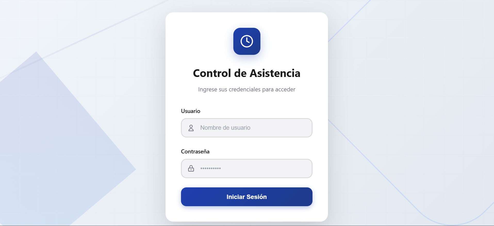
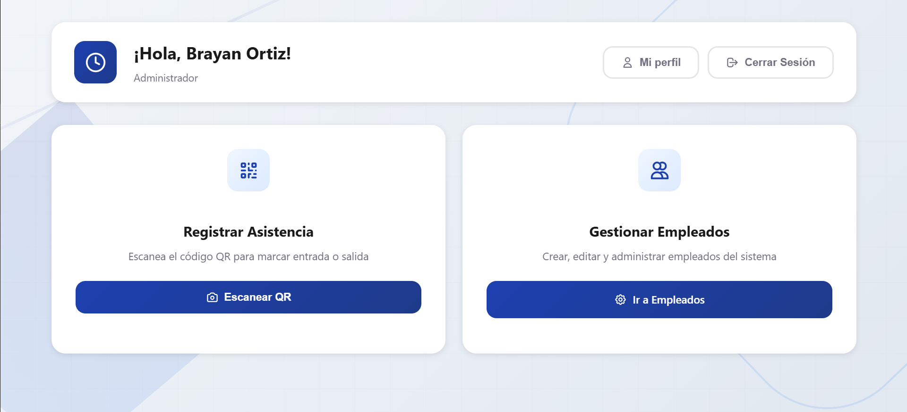
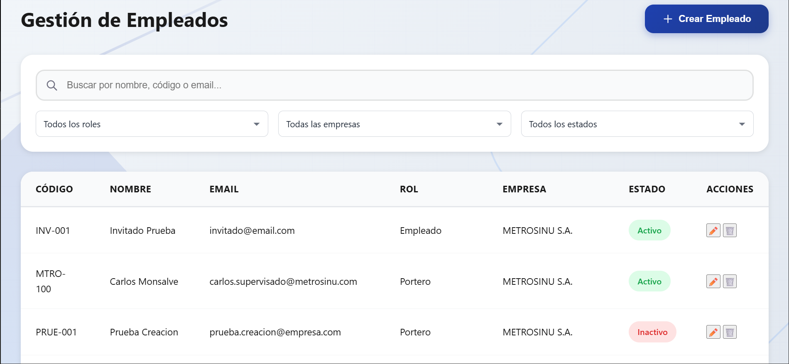
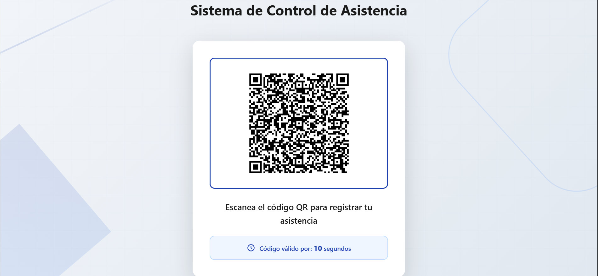
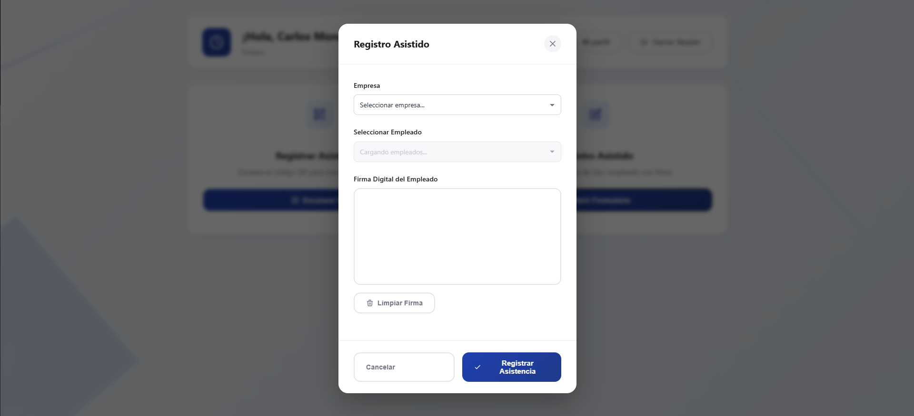
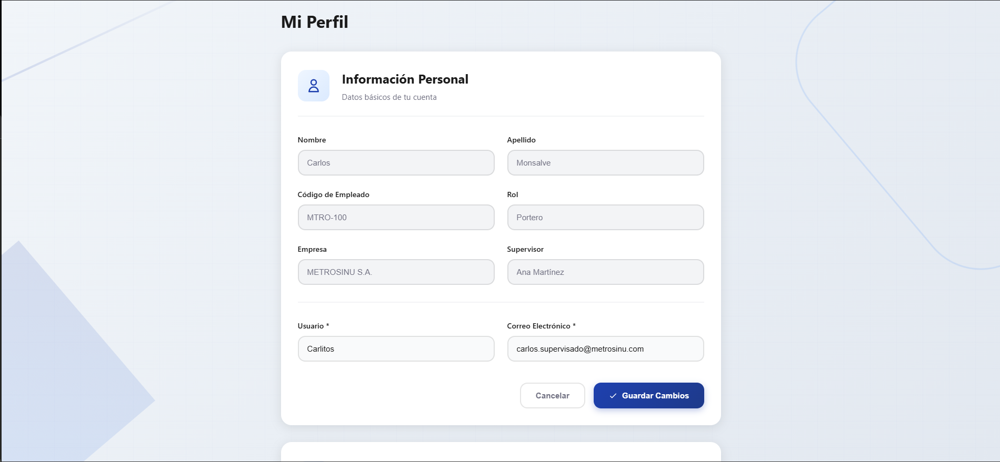

# 🕐 Sistema C.A.R. - Control de Asistencia y Registro

<div align="center">


<br/>


**Sistema integral de control de asistencia con generación de códigos QR, registro asistido con firma digital y gestión completa de empleados.**

 • [Reportar Bug](https://github.com/BrayanOrt1z/app-registro-asistencia/issues)

</div>

---

## 📋 Tabla de Contenidos

- [Sobre el Proyecto](#-sobre-el-proyecto)
- [Características Principales](#-características-principales)
- [Screenshots](#-screenshots)
- [Stack Tecnológico](#-stack-tecnológico)
- [Arquitectura](#-arquitectura)
- [Instalación](#-instalación)
- [Configuración](#-configuración)
- [Uso](#-uso)
- [Estructura del Proyecto](#-estructura-del-proyecto)
- [API Endpoints](#-api-endpoints)
- [Roadmap](#-roadmap)
- [Contribuir](#-contribuir)
- [Licencia](#-licencia)
- [Contacto](#-contacto)

---

## 🎯 Sobre el Proyecto

Sistema C.A.R. es una aplicación web full-stack diseñada para empresas de transporte público que necesitan un sistema robusto de control de asistencia. El sistema permite a los empleados registrar su entrada y salida mediante códigos QR, ofrece registro asistido para personal sin dispositivos móviles, y proporciona una interfaz completa de administración de empleados.

### Problema que Resuelve

Las empresas de transporte enfrentan desafíos al controlar la asistencia de empleados en múltiples rutas y sedes. Este sistema:
- ✅ Elimina el registro manual en papel.
- ✅ Previene fraudes de asistencia.
- ✅ Centraliza la información de múltiples empresas.
- ✅ Facilita el registro para personal sin smartphones.
- ✅ Genera reportes automáticos de asistencia.

### Contexto Real

**Proyecto de iniciativa propia** desarrollado al identificar una oportunidad de mejora en procesos operativos del sector transporte.

**Problema observado:** En empresas de transporte público como METROSINU S.A. (Montería, Colombia), el registro de asistencia de empleados se realiza manualmente en papel, consumiendo aproximadamente 4 horas diarias en procesamiento administrativo.

**Solución propuesta:** Sistema digital que automatiza completamente el proceso:
- ✅ Registro por código QR (sin contacto, sin papel)
- ✅ Validación instantánea con JWT
- ✅ Reducción del tiempo de procesamiento de 4h a 15 minutos
- ✅ Centralización de datos en tiempo real
- ✅ Trazabilidad completa con firma digital

**Valor demostrado:**
- Ahorro de tiempo: **93.75%** de reducción en procesamiento
- Escalable a múltiples empresas.

Este proyecto demuestra mi capacidad para:
- Identificar oportunidades de mejora en procesos existentes.
- Diseñar soluciones técnicas escalables.
- Desarrollar aplicaciones full-stack end-to-end.
- Crear valor tangible con tecnología.

---

## ✨ Características Principales

### 🔐 Sistema de Autenticación
- Login seguro con JWT (JSON Web Tokens).
- Encriptación de contraseñas con bcrypt.
- Sesiones persistentes con cookies httpOnly.
- Control de acceso basado en roles (RBAC).

### 👥 Gestión de Empleados (Administradores)
- **CRUD Completo**: Crear, leer, actualizar y eliminar empleados.
- **Filtros Avanzados**: Por empresa, rol, estado (activo/inactivo).
- **Búsqueda en Tiempo Real**: Por nombre, código de empleado o email.
- **Asignación de Roles**: Admin, Admin-QR, Supervisor,Portero, Empleado.
- **Multi-empresa**: Gestión de empleados de múltiples compañías.

### 📱 Registro de Asistencia con QR
- **Generación Dinámica**: Códigos QR únicos que se regeneran cada 20 segundos.
- **Escaneo por Cámara**: Compatible con cualquier dispositivo móvil.
- **Validación de Token**: Verificación de autenticidad y expiración.
- **Vista Dedicada**: Pantalla completa para Admin-QR (ej: tablets en recepción).

### ✍️ Registro Asistido (Porteros)
- Selección de empresa y empleado.
- **Firma Digital**: Captura de firma del empleado como evidencia.
- Validación de firma antes de registrar.
- Diseñado para empleados sin smartphone.

### 👤 Gestión de Perfil
- Actualización de información personal (usuario, email).
- Cambio de contraseña con validación de contraseña actual.
- Validación de unicidad de usuario y correo.

### 🎨 UX/UI Profesional
- Diseño responsive (móvil, tablet, escritorio).
- Animaciones suaves y efectos hover.
- Sistema de alertas modales.
- Páginas de error personalizadas (403, 404, 500).
- Loading states y estados vacíos.
- Favicon personalizado.

---

## 📸 Screenshots

### Login
<div align="center">
  
  <p><em>Pantalla de inicio de sesión con validaciones en tiempo real</em></p>
</div>

### Dashboard - Administrador
<div align="center">
  
  <p><em>Panel principal para administradores con acceso a todas las funcionalidades</em></p>
</div>

### Gestión de Empleados
<div align="center">
  
  <p><em>Sistema completo de CRUD con filtros avanzados y búsqueda en tiempo real</em></p>
</div>

### Generación de QR (Admin-QR)
<div align="center">
  
  <p><em>Vista de pantalla completa con código QR que se regenera cada 20 segundos</em></p>
</div>

### Registro Asistido (Portero)
<div align="center">
  
  <p><em>Formulario de registro con firma digital para empleados sin smartphone</em></p>
</div>

### Perfil de Usuario
<div align="center">
  
  <p><em>Edición de información personal y cambio de contraseña</em></p>
</div>

---

## 🛠️ Stack Tecnológico

### Frontend
- **HTML5** - Estructura semántica.
- **CSS3** - Estilos personalizados con animaciones.
- **JavaScript (Vanilla)** - Lógica del cliente sin frameworks.
- **QRCode.js** - Generación de códigos QR.
- **html5-qrcode** - Escaneo de códigos QR por cámara.
- **Signature Pad** - Captura de firmas digitales.

### Backend
- **Node.js** (v18+) - Runtime de JavaScript.
- **Express.js** - Framework web minimalista.
- **MySQL** - Base de datos relacional.
- **JWT** - Autenticación basada en tokens.
- **bcrypt** - Encriptación de contraseñas.
- **cookie-parser** - Manejo de cookies.
- **CORS** - Configuración de seguridad.

### Herramientas de Desarrollo
- **Git** - Control de versiones.
- **ESM** - Módulos ES6 nativos.
- **dotenv** - Variables de entorno.

---

## 🏗️ Arquitectura

### Arquitectura de Tres Capas
```
┌─────────────────────────────────────────────────────────┐
│                      FRONTEND (Cliente)                  │
│  ┌──────────┐  ┌──────────┐  ┌──────────┐  ┌─────────┐ │
│  │ login.js │  │dashboard │  │employees │  │profile  │ │
│  │          │  │   .js    │  │   .js    │  │  .js    │ │
│  └──────────┘  └──────────┘  └──────────┘  └─────────┘ │
│                                                          │
│  ┌────────────────────────────────────────────────────┐ │
│  │            Fetch API (HTTP/HTTPS)                  │ │
│  └────────────────────────────────────────────────────┘ │
└─────────────────────────────────────────────────────────┘
                         ▼
┌─────────────────────────────────────────────────────────┐
│                  BACKEND (Servidor API)                  │
│  ┌──────────────────────────────────────────────────┐   │
│  │              Middleware                          │   │
│  │  - CORS, Cookie Parser, JSON Parser             │   │
│  │  - Autenticación JWT                            │   │
│  └──────────────────────────────────────────────────┘   │
│                         ▼                                │
│  ┌──────────────────────────────────────────────────┐   │
│  │              Routes                              │   │
│  │  /auth, /profile, /employees, /attendance       │   │
│  └──────────────────────────────────────────────────┘   │
│                         ▼                                │
│  ┌──────────────────────────────────────────────────┐   │
│  │            Controllers                           │   │
│  │  - Lógica de negocio                            │   │
│  │  - Validaciones                                 │   │
│  └──────────────────────────────────────────────────┘   │
│                         ▼                                │
│  ┌──────────────────────────────────────────────────┐   │
│  │              Models                              │   │
│  │  - Interacción con base de datos                │   │
│  └──────────────────────────────────────────────────┘   │
└─────────────────────────────────────────────────────────┘
                         ▼
┌─────────────────────────────────────────────────────────┐
│                BASE DE DATOS (MySQL)                     │
│  ┌──────────┐  ┌──────────┐  ┌──────────┐  ┌─────────┐ │
│  │empleados │  │ empresas │  │   roles  │  │ movim.  │ │
│  └──────────┘  └──────────┘  └──────────┘  └─────────┘ │
└─────────────────────────────────────────────────────────┘
```

### Patrón MVC (Model-View-Controller)

- **Models**: Encapsulan la lógica de acceso a datos.
- **Controllers**: Manejan las peticiones y respuestas HTTP.
- **Views**: Frontend en HTML/CSS/JS vanilla.

---

## 🚀 Instalación

### Prerrequisitos

- **Node.js** v18.0.0 o superior.
- **MySQL** 8.0 o superior.
- **npm** o **yarn**.
- **Git**.

### Clonar el Repositorio
```bash
git clone https://github.com/BrayanOrt1z/app-registro-asistencia.git
cd sistema-car
```

### Instalar Dependencias
```bash
npm install
```

### Configurar Base de Datos

1. Crear la base de datos:
```sql
CREATE DATABASE sistema_car CHARACTER SET utf8mb4 COLLATE utf8mb4_unicode_ci;
```

2. Importar el esquema:
```bash
mysql -u tu_usuario -p sistema_car < database/development_schema.sql
```

---

## ⚙️ Configuración

### Variables de Entorno

Crear un archivo `.env` en la raíz del proyecto:
```env
# Server
PORT=3000
NODE_ENV=development

# Database
DB_HOST=localhost
DB_PORT=3306
DB_USER=tu_usuario
DB_PASSWORD=tu_contraseña
DB_NAME=asistencia_db

# JWT
JWT_SECRET=tu_codigo_seguro_aqui
JWT_EXPIRES_IN=8h

# CORS
CORS_ORIGIN=http://localhost:3000

# Cookies
COOKIE_SECRET=codigo_secreto_diferente_para_cookies
```

### Configuración de Producción

Para producción, asegúrate de:
- Usar contraseñas fuertes y únicas para JWT_SECRET
- Configurar HTTPS
- Establecer `NODE_ENV=production`
- Configurar CORS con el dominio de producción
- Activar rate limiting en el servidor

---

## 💻 Uso

### Desarrollo
```bash
# Iniciar servidor de desarrollo
npm start

# El servidor estará disponible en:
# http://localhost:3000
```

### Producción
```bash
# Instalar dependencias de producción
npm install --production

# Iniciar servidor
NODE_ENV=production npm start
```

---

## 📁 Estructura del Proyecto
```
sistema-car/
├── client/                    # Frontend
│   ├── assets/
│   │   ├── css/              # Estilos
│   │   │   ├── styles_login.css
│   │   │   ├── styles_dashboard.css
│   │   │   ├── styles_employees.css
│   │   │   ├── styles_profile.css
│   │   │   └── styles_errorPages.css
│   │   ├── images/           # Imágenes y favicon
│   │   │   └── favicon.svg
│   │   └── js/               # JavaScript del cliente
│   │       ├── login.js
│   │       ├── dashboard.js
│   │       ├── employees.js
│   │       ├── profile.js
│   │       └── formatValues.js
│   └── pages/                # Páginas HTML
│       ├── login.html
│       ├── dashboard.html
│       ├── employees.html
│       ├── profile.html
│       ├── 403.html
│       ├── 404.html
│       └── 500.html
│
├── server/                    # Backend
│   ├── config/
│   │   └── database.js       # Configuración MySQL
│   ├── controllers/          # Controladores
│   │   ├── authController.js
│   │   ├── profileController.js
│   │   ├── employeeController.js
│   │   └── attendanceController.js
│   ├── middleware/           # Middleware
│   │   ├── auth.js
|   |   ├── errorHandler.js
|   |   └── notFound.js
│   ├── models/               # Modelos
│   │   ├── userModel.js
│   │   ├── companyModel.js
│   │   ├── roleModel.js
│   │   └── attendanceModel.js
│   ├── routes/               # Rutas
│   │   ├── authRoutes.js
│   │   ├── profileRoutes.js
│   │   ├── employeeRoutes.js
│   │   └── attendanceRoutes.js
│   ├── utils/                # Utilidades
│   │   └── responses.js
│   ├── app.js      # Configuración servidor
|   └── server.js       # Iniciar servidor
│
├── database/                  # Base de datos
│   ├── development_schema.sql          # Datos de ejemplo
│   └── install_sql.sql                 # Esquema de la DB
│
├── docs
|   └── car_system_flows.md  #Explicación del flujo del sistema
|
├── .env              # Variables de entorno creadas por ustedes
├── .gitignore
├── package.json
└── README.md
```

---

## 🔌 API Endpoints

### Autenticación
```http
POST   /api/auth/login        # Iniciar sesión
POST   /api/auth/logout       # Cerrar sesión
```

### Perfil
```http
GET    /api/profile/           # Obtener perfil actual
PUT    /api/profile/           # Actualizar perfil
PUT    /api/profile/password   # Cambiar contraseña
```

### Empleados
```http
GET    /api/employees/                      # Listar todos los empleados
GET    /api/employees/:id                   # Obtener empleado por ID
POST   /api/employees/                      # Crear empleado
PUT    /api/employees/:id                   # Actualizar empleado
DELETE /api/employees/:id                   # Eliminar (desactivar) empleado
GET    /api/employees/by-company            # Filtrar por empresa
GET    /api/employees/lookups/companies     # Listar empresas
GET    /api/employees/lookups/roles         # Listar roles
GET    /api/employees/lookups/supervisors   # Listar supervisores por empresa
```

### Asistencia
```http
GET    /api/attendance/qr          # Generar código QR
POST   /api/attendance/register         # Validar y registrar asistencia por QR
POST   /api/attendance/assisted-register             # Registro asistido con firma
```

---

## 🗺️ Roadmap

### 📊 Fase 2 - Reportes y Estadísticas
- [ ] Panel de reportes de asistencia
- [ ] Exportación de reportes a Excel/PDF
- [ ] Dashboard con métricas en tiempo real

### 📱 Fase 3 - Aplicación Móvil
- [ ] App móvil nativa (React Native)
- [ ] Registro offline con sincronización
- [ ] Notificaciones push

### 🔧 Mejoras Continuas
- [ ] Tests automatizados (Jest + Supertest)
- [ ] Documentación de API con Swagger
- [ ] Containerización con Docker
- [ ] CI/CD con GitHub Actions
- [ ] Logs centralizados (Winston)
- [ ] Rate limiting y throttling

---

## 🤝 Contribuir

Las contribuciones son bienvenidas. Para cambios importantes:

1. Haz fork del proyecto
2. Crea una rama para tu feature (`git checkout -b feature/yourFeature`)
3. Haz commit de tus cambios (`git commit -m 'feat: Add yourFeature'`)
4. Push a la rama (`git push origin feature/yourFeature`)
5. Abre un Pull Request

### Guía de Estilo de Commits

Este proyecto usa [Conventional Commits](https://www.conventionalcommits.org/):
```
feat: nueva funcionalidad
fix: corrección de bug
docs: cambios en documentación
style: formato, punto y coma faltante, etc
refactor: refactorización de código
test: agregar tests
chore: mantenimiento
```

---

## 📄 Licencia

Este proyecto está bajo la Licencia MIT. Ver el archivo `LICENSE` para más detalles.

---

## 📧 Contacto

**Brayan Ortiz**

- Email: brayanortizg7@gmail.com
- GitHub: [@BrayanOrt1z](https://github.com/BrayanOrt1z)

**Link del Proyecto**: [https://github.com/BrayanOrt1z/app-registro-asistencia](https://github.com/BrayanOrt1z/app-registro-asistencia)

---

<div align="center">

⭐ Si este proyecto te fue útil, considera darle una estrella ⭐

**Desarrollado por Brayan Ortiz**

</div>